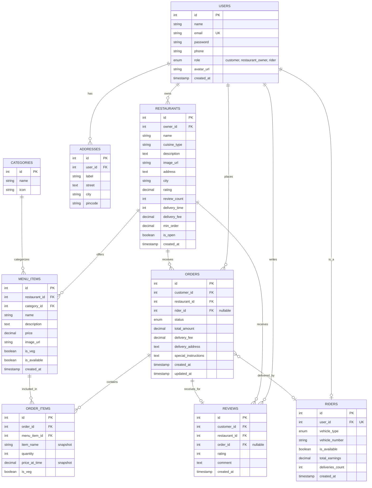

# Food Delivery App ER Diagram

```mermaid
erDiagram
    USERS ||--o{ RESTAURANTS : owns
    USERS ||--o| RIDERS : is_a
    USERS ||--o{ ADDRESSES : has
    USERS ||--o{ ORDERS : places
    USERS ||--o{ REVIEWS : writes

    RESTAURANTS ||--o{ MENU_ITEMS : offers
    RESTAURANTS ||--o{ ORDERS : receives
    RESTAURANTS ||--o{ REVIEWS : receives

    CATEGORIES ||--o{ MENU_ITEMS : categorizes

    ORDERS ||--o{ ORDER_ITEMS : contains
    ORDERS ||--o| REVIEWS : receives_for
    ORDERS }o--o| RIDERS : delivered_by

    MENU_ITEMS ||--o{ ORDER_ITEMS : included_in

    USERS {
        int id PK
        string name
        string email UK
        string password
        string phone
        enum role "customer, restaurant_owner, rider"
        string avatar_url
        timestamp created_at
    }

    RESTAURANTS {
        int id PK
        int owner_id FK
        string name
        string cuisine_type
        text description
        string image_url
        text address
        string city
        decimal rating
        int review_count
        int delivery_time
        decimal delivery_fee
        decimal min_order
        boolean is_open
        timestamp created_at
    }

    RIDERS {
        int id PK
        int user_id FK "UK"
        enum vehicle_type
        string vehicle_number
        boolean is_available
        decimal total_earnings
        int deliveries_count
        timestamp created_at
    }

    ADDRESSES {
        int id PK
        int user_id FK
        string label
        text street
        string city
        string pincode
    }

    CATEGORIES {
        int id PK
        string name
        string icon
    }

    MENU_ITEMS {
        int id PK
        int restaurant_id FK
        int category_id FK
        string name
        text description
        decimal price
        string image_url
        boolean is_veg
        boolean is_available
        timestamp created_at
    }

    ORDERS {
        int id PK
        int customer_id FK
        int restaurant_id FK
        int rider_id FK "nullable"
        enum status
        decimal total_amount
        decimal delivery_fee
        text delivery_address
        text special_instructions
        timestamp created_at
        timestamp updated_at
    }

    ORDER_ITEMS {
        int id PK
        int order_id FK
        int menu_item_id FK
        string item_name "snapshot"
        int quantity
        decimal price_at_time "snapshot"
        boolean is_veg
    }

    REVIEWS {
        int id PK
        int customer_id FK
        int restaurant_id FK
        int order_id FK "nullable"
        int rating
        text comment
        timestamp created_at
    }
```
